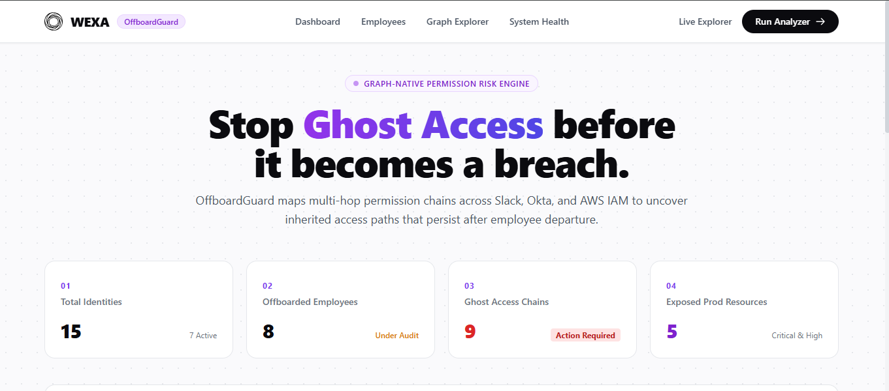
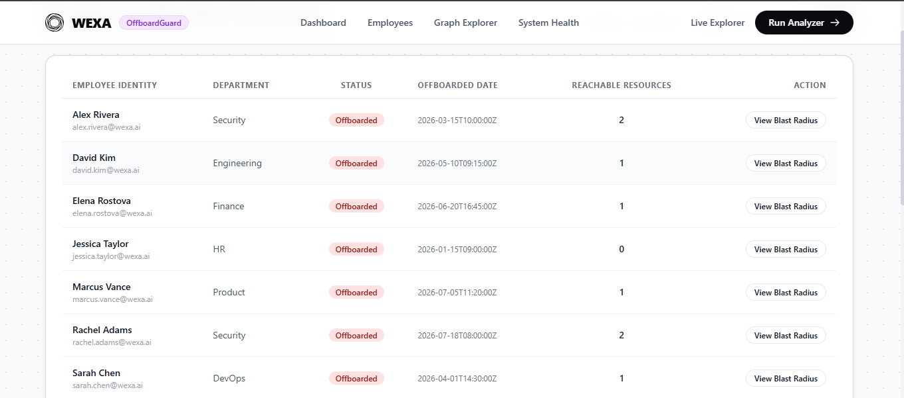
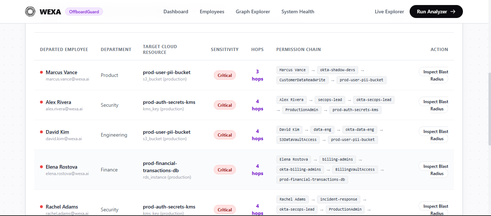
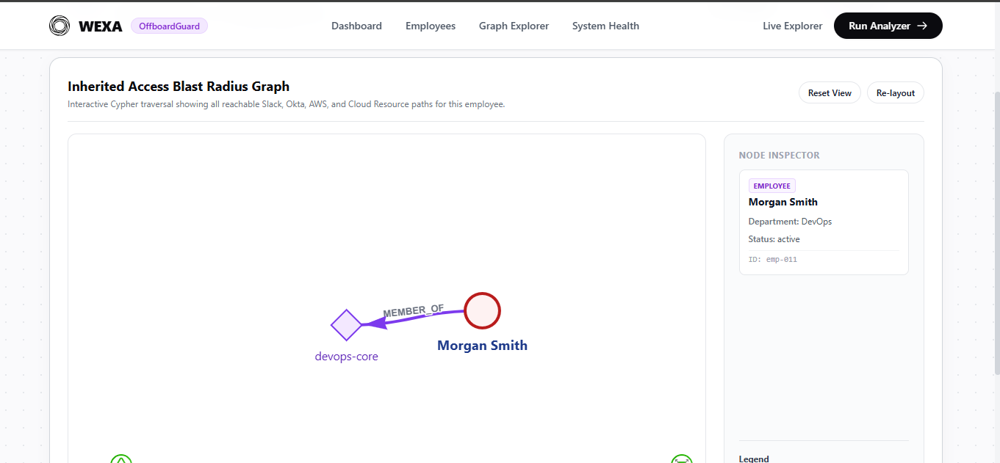
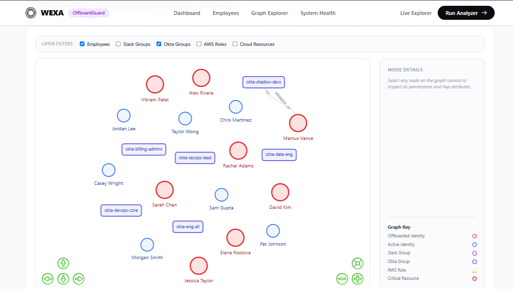
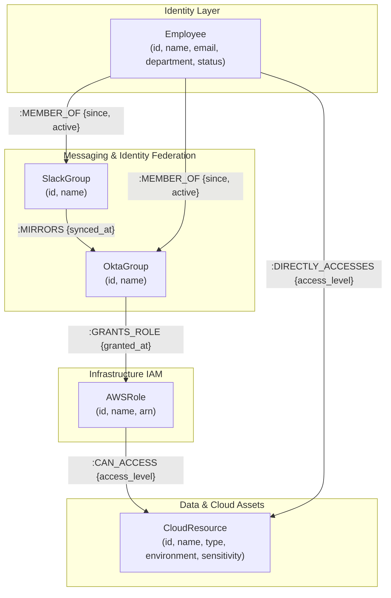

# OffboardGuard — Graph-Based Permission & Offboarding Analyzer

**OffboardGuard** is a graph-database-backed web application built for **Wexa AI**. It uses **CognoDB** (an openCypher/Bolt-compatible managed graph database) accessed via the official `neo4j` Python driver to detect inherited permission paths and **"Ghost Access"** risks for offboarded employees.

---

## 🔗 Project Links

- **GitHub Repository**: [https://github.com/SoumyaSriMishra/offboard-guard.git](https://github.com/SoumyaSriMishra/offboard-guard.git)

---

## 📸 Application Screenshots

### 📊 Dashboard & Flagship Ghost Access Findings


### 👥 Employees Directory & Risk Filters


### 👤 Employee Profile & Blast Radius Inspector


### 🌐 Inherited Access Blast Radius Graph Topology


### 🕸️ Vis-Network Interactive Network Graph Explorer


---

## 1. Domain Problem & Use Case

When an employee leaves an organization, IT administrators revoke their *direct* accounts and identity access. However, in modern cloud-native enterprises, permissions are almost never granted directly. Instead, access cascades through multi-hop inherited structures: an employee joins a Slack channel, which is automatically mirrored to an Okta group, which assumes an AWS IAM role, which provides read/write access to a production S3 bucket or RDS database.

Simply disabling an employee's main login does **not** sever these indirect, inherited permission chains. If a former employee's group membership is omitted during deprovisioning or an Okta sync rule remains active, the result is **Ghost Access** — permission paths that technically still resolve to a departed employee's identity.

OffboardGuard continuously traverses these multi-hop identity chains across Slack, Okta, and AWS IAM to uncover all indirect reachability paths to critical resources and flag offboarded employees who retain live paths into production infrastructure.

---

## 2. Why a Graph Database?

Determining whether a relational database row has permission is straightforward with a single JOIN. However, security governance is rarely a single-hop lookup. The core question is:

> *"Through how many hops, and via which indirect path, can identity X reach resource Y?"*

### Why Relational Databases (SQL) Struggle with Ghost Access:
1. **Variable-Length Path Traversals**: In real organizations, the distance between an employee and a resource is variable (2 hops, 4 hops, or 6 hops). Expressing variable-depth paths in SQL requires complex recursive Common Table Expressions (CTEs) or predicting fixed N-table self-JOINs.
2. **Performance Penalty**: Each hop in SQL requires joins across junction tables (`Employee_Slack`, `Slack_Okta`, `Okta_AWS`, `AWS_Resource`). Searching for arbitrary paths at scale causes exponential join explosion.
3. **Relationship-Native Semantics**: Graph property models natively store metadata on relationships (e.g., `MEMBER_OF.since`, `CAN_ACCESS.access_level`).

### The Cypher Advantage:
Finding every production resource reachable by an offboarded employee through *any* sequence of 1 to 6 hops is expressed concisely in Cypher:

```cypher
MATCH (e:Employee {status: 'offboarded'})
MATCH path = (e)-[:MEMBER_OF|MIRRORS|GRANTS_ROLE|CAN_ACCESS|DIRECTLY_ACCESSES*1..6]->(r:CloudResource)
WHERE r.environment = 'production'
WITH e, r, path, length(path) AS hops
RETURN e.name AS employee, r.name AS resource, r.sensitivity AS sensitivity,
       hops, [n IN nodes(path) | coalesce(n.name, labels(n)[0])] AS chain
ORDER BY sensitivity DESC, hops ASC
```

This single declarative query traverses all variable-depth paths natively in Cypher without needing prior knowledge of the path length.

---

## 3. Graph Data Model

The diagram below illustrates the node labels and relationship types modeled in CognoDB:



---

## 4. Setup & Running Instructions

### Step 1: Create a CognoDB Instance
1. Go to [consolecognodb.com](https://console.cognodb.com) and create a free `c0` instance.
2. Copy the Bolt connection URI (`bolt+s://db-xxxxx.databases.cognodb.com`), username (`cognodb`), and password.

### Step 2: Configure Environment Variables
Copy `.env.example` to `.env` and fill in your CognoDB credentials:

```bash
cp .env.example .env
```

Edit `.env`:
```env
COGNO_URI=bolt+s://<your-instance-id>.databases.cognodb.com
COGNO_USER=cognodb
COGNO_PASSWORD=<your-saved-password>
```

### Step 3: Install Dependencies
Create a Python virtual environment and install dependencies:

```bash
python -m venv .venv
source .venv/bin/activate  # On Windows: .venv\Scripts\activate
pip install -r requirements.txt
```

### Step 4: Seed the Graph Database
Run the seed script to populate realistic employees, groups, roles, resources, and 7+ explicit multi-hop "Ghost Access" scenarios:

```bash
python scripts/seed_data.py --reset
```

### Step 5: Launch the Application
Start the FastAPI development server:

```bash
uvicorn app.main:app --reload --port 8000
```

Open your browser at `http://127.0.0.1:8000`.

---

## 5. Main Cypher Queries Explained

All queries are located in `app/db/queries.py` and are strictly parameterized to prevent Cypher injection.

### 1. Flagship Ghost Access Detector (`query_ghost_access_chains`)
- **Purpose**: Identifies offboarded employees who still possess active permission paths to production resources.
- **Cypher**:
  ```cypher
  MATCH (e:Employee {status: 'offboarded'})
  MATCH path = (e)-[:MEMBER_OF|MIRRORS|GRANTS_ROLE|CAN_ACCESS|DIRECTLY_ACCESSES*1..6]->(r:CloudResource)
  WHERE r.environment = $environment
  RETURN e.id, e.name, r.name, r.sensitivity, length(path) AS hops, nodes(path), relationships(path)
  ORDER BY sensitivity DESC, hops ASC
  LIMIT $limit
  ```

### 2. Employee Blast Radius (`query_employee_blast_radius`)
- **Purpose**: Returns all nodes and relationships reachable from a single employee ID to visualize their complete blast radius.
- **Cypher**:
  ```cypher
  MATCH (e:Employee {id: $employee_id})
  OPTIONAL MATCH path = (e)-[:MEMBER_OF|MIRRORS|GRANTS_ROLE|CAN_ACCESS|DIRECTLY_ACCESSES*1..6]->(r:CloudResource)
  RETURN collect(DISTINCT nodes(path)) AS all_nodes, collect(DISTINCT relationships(path)) AS all_rels
  ```

### 3. Shared Access Risk (`query_shared_access_risk`)
- **Purpose**: Finds production resources reachable by two distinct employees to evaluate toxic combination access.

### 4. Aggregate Dashboard Metrics (`query_dashboard_stats`)
- **Purpose**: Computes identity counts, active ghost chains, and top 5 highest-risk cloud resources.

---

## 6. Architecture & Tech Stack

- **Language**: Python 3.10+
- **Framework**: FastAPI (ASGI) + Uvicorn
- **Database Driver**: Official `neo4j` Python driver (`GraphDatabase.driver`)
- **Templating**: Jinja2 HTML templates
- **Styling**: Tailwind CSS via CDN + `static/css/tokens.css` (Wexa AI brand system)
- **Graph Explorer**: `vis-network.js` via CDN
- **Validation**: Pydantic (v2) models in `app/models/schemas.py`

---

## 7. UI & Wexa AI Brand Design System

OffboardGuard inherits **Wexa AI's visual identity**:
- **Palette**: `#0B0B0F` near-black ink, `#7C3AED` accent purple highlights, crisp white surface cards with hairline borders (`#E5E7EB`).
- **Typography**: Geometric display headings with heavy weight, tight tracking, and readable 16px body copy.
- **Layout**: 4-column metric grid featuring numbered eyebrow badges (`01`, `02`, `03`, `04` in accent purple).
- **Buttons**: Solid black pill (`rounded-full bg-[#0B0B0F] text-white`) and white outline pill buttons.
- **Design Path Disclosure**: Implemented using the **Token-Spec-Only Path** derived directly from the Wexa AI brand reference design.

---

## 8. Resilience & Graceful Error Handling

OffboardGuard is designed to remain fully functional even if the database is temporarily unreachable:
- Startup connectivity check via `driver.verify_connectivity()`.
- If CognoDB is offline or DNS lookup fails, the app boots gracefully without process crashes.
- All routes display a friendly yellow **"Database Warning"** banner and render offline placeholder states instead of 500 error stack traces.
- System health can be sanity-checked at `GET /health`.
